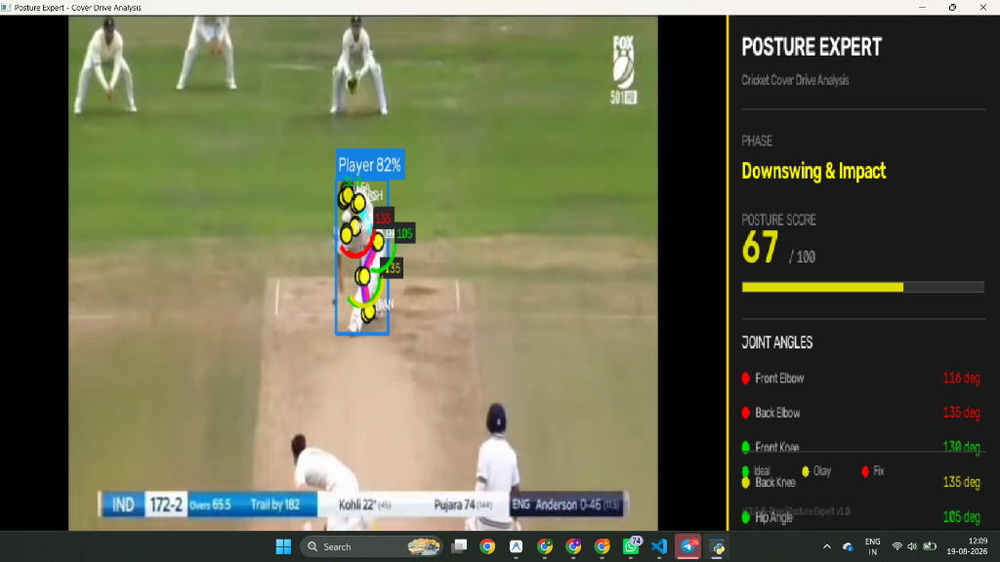

# 🏏 Posture Expert — Cricket Cover Drive Analysis



Full-body keypoint detection and biomechanical analysis for the cricket cover drive shot, powered by **YOLOv8 Pose Estimation**.

## Features

- **Intelligent Tracking** — Smart heuristics perfectly lock onto the striker, ignoring fielders, non-strikers, and bowlers.
- **Broadcast-Style Freeze Frame** — Video plays cleanly, automatically pausing exactly at the "Impact" phase to display the analysis overlay.
- **17 COCO Keypoints** — detects nose, eyes, ears, shoulders, elbows, wrists, hips, knees, and ankles.
- **6 Joint Angles** — front/back elbow, front/back knee, hip rotation, shoulder alignment.
- **4-Phase Detection** — Stance → Backswing & Stride → Downswing & Impact → Follow-through.
- **Posture Score** — 0–100 composite score based on biomechanical ideals.
- **Live Coaching Tips** — actionable feedback on form corrections.
- **HUD Dashboard** — real-time on-screen overlay with all metrics.

## Libraries & Architecture

This project leverages three primary core libraries to achieve real-time biomechanical analysis:

- **[Ultralytics (YOLOv8)](https://github.com/ultralytics/ultralytics):** Responsible for the core AI pose estimation. It takes raw video frames and outputs 17 highly-accurate human body keypoints (coordinates and confidence scores) in real-time.
- **[OpenCV (`cv2`)](https://opencv.org/):** Responsible for the video processing pipeline. It reads video files, extracts frames, handles the graphical user interface (drawing the skeleton, joint arcs, text, side-panel HUD), and saves the final analyzed video output.
- **[NumPy](https://numpy.org/):** Responsible for the heavy mathematical lifting. It processes the raw keypoint coordinate arrays and calculates the complex 3-point vertex geometry (using trigonometry/arctangents) to measure exact joint angles (e.g., knee flexion).

## Quick Start

### 1. Install Dependencies

```bash
pip install -r requirements.txt
```

### 2. Run

```bash
# Easiest way: Open file picker to select a video
python main.py

# Analyze a video directly from CLI
python main.py --video batting_clip.mp4

# Analyze a single image
python main.py --image cover_drive.jpg
```

### 3. Controls

| Key       | Action                                      |
|-----------|---------------------------------------------|
| `q` / ESC | Quit                                        |
| `s`       | Save screenshot                             |
| `p`       | Manual Pause (Instantly analyzes the frame) |

## Project Structure

```text
tech_s_yolo/
├── main.py                  # CLI entry point, file picker & video loop
├── pose_detector.py         # YOLOv8 wrapper & smart striker identification
├── angle_calculator.py      # Joint angle computation (NumPy trigonometry)
├── cover_drive_analyzer.py  # Phase detection & biomechanical scoring
├── visualizer.py            # Skeleton drawing & HUD rendering (OpenCV)
├── config.py                # Constants & thresholds
├── requirements.txt         # Dependencies
└── README.md                # This file
```
